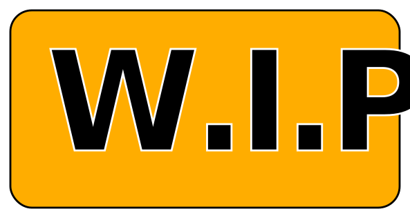
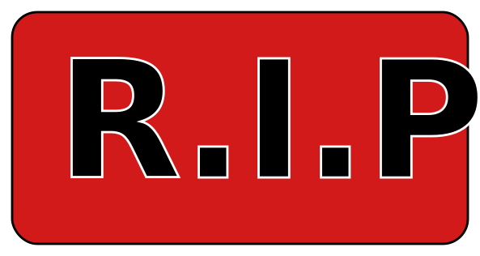
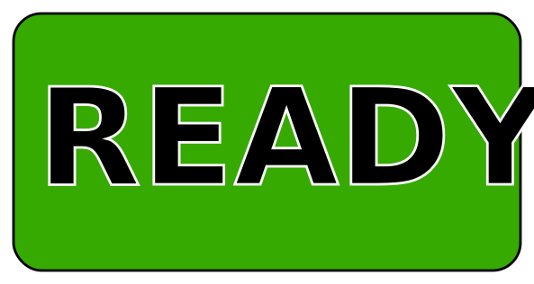

# Contributing

Thank you for your interest in contributing to an OWASP project.
The Dungeon & Daemons project is an open source effort and welcome all kinds of contributions and feedback.

## Help us to improve & join our community by:

- Reporting an error (typos, grammer) or fix it on a pull-request.
- Give feedback.
- Ask questions

## Getting Started

To get started with contributing to any OWASP project, please follow these steps:

1. [Join](http://owasp.org/slack/invite) the [OWASP Slack workspace](https://owasp.slack.com) to connect with the OWASP community and get help with any questions you may have.

2. Review the [OWASP Projects](https://owasp.org/projects/) page to browse the list of OWASP projects and find a project that aligns with your interests and skills.

3. Visit the project's individual page and repository to familiarize yourself with the project goals and objectives.

4. Fork the repository and clone it to your local machine.

5. Install any necessary dependencies and set up your development environment.

6. Make your changes and test them locally to ensure they work as expected.

7. Submit a pull request with your changes.

## Pull Request Guidelines

Before submitting a pull request, please make sure:

1. Your changes are consistent with the project's goals and objectives.

2. Your changes are well-documented and follow the project's coding standards.

3. Your changes do not introduce new bugs or break existing functionality.

4. Your changes are accompanied by tests, if applicable.

5. Your pull request includes a clear and concise description of the changes you have made.

## Contribute with content:

- Propose ideas or suggest improvements. If it qualifies, we'll promote it to an issue.
- Create a pull request for concrete fixes or translations for games that is ready to be played (e.g grammer/typos/fix). Changes need to be approved by the core team.
- Create a pull request for games where help is needed (e.g any type of change). Any type of change is welcome.
- Create a pull request for games where work is in progress (e.g any type of change). All fixes are welcome, but feature requests or changes to the game rules, story arc, need to be discussed before being made.
- Create a pull request for games labeled "R.I.P" (e.g: any type of change). All changes are welcome, but it might get removed at a later stage unless you can considerably improve the quality of the game.  

## Where can I start?

- A good idea would be to go to https://dungeonsanddaemons.org/games when you click on a game, each game will be labeled: ready, w.i.p, r.i.p or help wanted. These labels tells you how you may proceede contributing to the game.

Some of the games that got created where storytelling/storybook games. These games were created using yaml and you may simply change the yaml under [characters](characters), [games](games), [rules](rules), [static/images](images). Keep in mind that when adding content please add it into the game's respective folder under the main folders above. This way, your game will be made available correctly online.

"Help wanted!" Means that any contribution is more then welcome. The game is dependent on your contributions to get ready and playable by the comunity.

"W.I.P", means that this is work in progress, contributions are welcome, but the original creator might want you to make contributions according to the ideas of the game creator. It may be a good idea to ask a question in the github forum, create a github issue or discuss the finer point on slack with the game creator befor making any larger contributions.

"R.I.P", means the game is dead. We won't be maintaining it and it might get removed. You can just restart the development of the game, but you will have to get it up to a level where you can play it before we change the status back to "W.I.P" or "READY".

"Ready", means the game can be played and are in maintanence mode, bugfixes, changes and translations are still needed, but there won't be any large changes to the story or game rules. If you want to change the game, you should discuss it with the game creator before proposing your changes.

## Code of Conduct

We ask that all contributors to OWASP projects abide by our [Code of Conduct](https://owasp.org/www-policy/operational/code-of-conduct). This code outlines our expectations for behavior within the project community and helps us maintain a welcoming and inclusive environment for all contributors.

Thank you for your interest in contributing to an OWASP project. We appreciate your efforts to help us improve and grow our projects.
